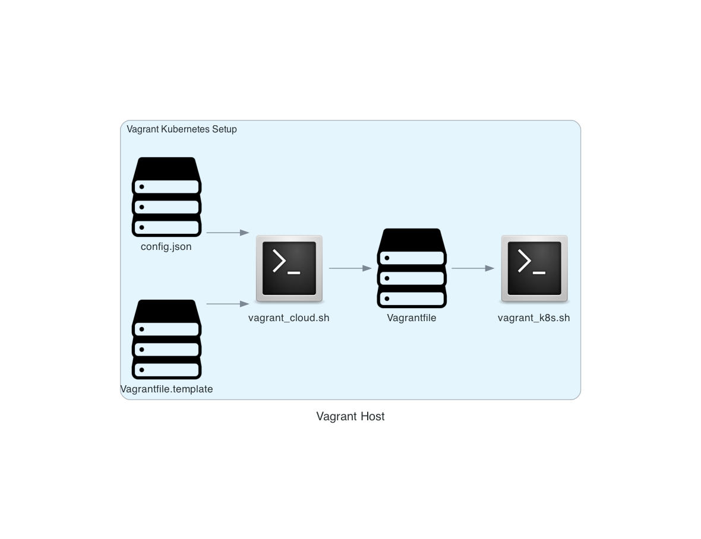

Vagrant_Kubernetes
==================

Sets up a cluster of vagrant nodes, then uses `kubespray` to install a k8s cluster on them.

Script `Vagrant_Kubernetes_Setup.sh` co-odinates eveything. Script `run_vagrant_kubernetes.sh` runs it as a background job and logs the output to `./vagrant_kubernetes.log`. To set up everything just run `run_vagrant_kubernetes.sh`, wait a while (for message `Script Vagrant_Kubernetes_Setup.sh has finished` to appear in the log file) then run `vagrant ssh node1` to access the 1st control node. When finished (after exiting the node), simply run `vagrant destroy -f` to get rid of the k8s cluster.

The number of control plane nodes (default 1) and worker nodes (default 1) are defined in `config.json`, along with RAM size (default 2048) and cpu counts (default 2). Each node is the same size.

`Vagrant_Kubernetes_Setup.sh` makes use of `~/.vagrant.d/insecure_private_key` to allow `node1` to ssh freely to each of the nodes (including itself). 
