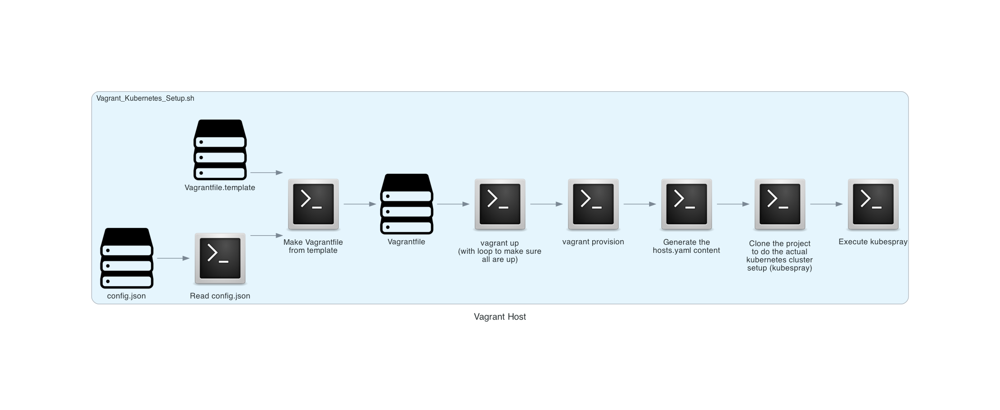

Vagrant_Kubernetes
==================

Sets up a cluster of vagrant nodes, then uses `kubespray` to install a k8s cluster on them.


Script `Vagrant_Kubernetes_Setup.sh` co-odinates eveything. It takes verbs `BACKUP`, `RECOVER`, `UP_ONLY`, and `SKIP_UP`.

`BACKUP` assumes that the cluster is up. It does a `vagrant susped` then copied the contents of .vagrant to a backup directory based on the time of the back, before doing a `vagrant resume`.

`RECOVERY` takes an extra argument of the backup to recover. It also assumes that the cluster is up and suspends vagrant, then copies all the files from the backup directory back to .vagrant before doing a `vagrant resume`.

`UP_ONLY` just does as far as the vagrant up in the description below, then exists.

`SKIP_UP` does everything after the `vagrant up` in the description below. It also assumes that the cluster is up when it is run.

Script `run_vagrant_kubernetes.sh` runs it as a background job and logs the output to `./vagrant_kubernetes.log`. To set up everything just run `run_vagrant_kubernetes.sh`, wait a while (for message `Script Vagrant_Kubernetes_Setup.sh has finished` to appear in the log file) then run `vagrant ssh node1` to access the 1st control node. When finished (after exiting the node), simply run `vagrant destroy -f` to get rid of the k8s cluster.



The number of control plane nodes (default 1) and worker nodes (default 1) are defined in `config.json`, along with RAM size (default 2048) and cpu counts (default 2) of each node. Each node is the same size for simplicity. `config.json` also defines the version of kubernetes to install on each node.

Here is an example `config.json` file:

```
	{
	  "kube_version": "v1.30.2",
	  "kubespray_version": "1ebd860c13d95e7f19dd12f1fd9fa316cb0f9740",
	  "control_nodes": 1,
	  "worker_nodes": 1,
	  "ram_size": 2048,
	  "cpu_count" : 2,
	  "pub_net": "192.168.0"
	}
```

The Vagrantfile includes a provisioning script that brings each ubuntu node's OS up to date. The Vagrantfile is engineered to use an arm64 image if running on an arm64 platform (like a recent Mac) or x86 otherwise.

`Vagrant_Kubernetes_Setup.sh` makes use of `~/.vagrant.d/insecure_private_key` to allow `node1` to ssh freely to each of the nodes (including itself). Before the script executes `kubespray` on node1 (that then takes charge of setting up all the nodes in the hosts.yaml), it takes time to ssh to each node from node1. 
