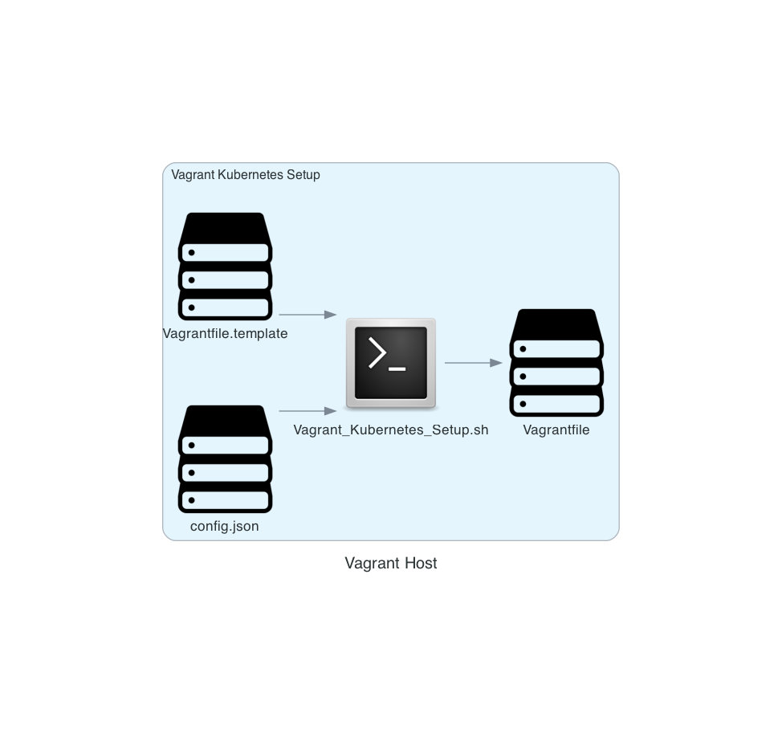

# Vagrant Kubernetes

This project sets up a Kubernetes (K8s) cluster either in a group of Vagrant boxes (which it sets up itself) or on a named set of nodes (which have to be set up by the user) using Kubespray.

## Overview

The main script `Make_Kubernetes.sh` orchestrates the entire setup process and supports both modes. It accepts the following commands:

- **UP_ONLY**: Brings up the Vagrant nodes and provisions them, where `--location vagrant` is used. Mandatory in this case.
- **SKIP_UP**: Skips bringing up the Vagrant nodes and proceeds directly to deploying Kubernetes on them (assumes nodes are already up). Optional if `--location physical`, otherwise mandatory.

### Usage

1. **Setting up Vagrant nodes**

   To set up everything in Vagrant, run the `Make_Kubernetes.sh` script.

   First, run with `UP_ONLY` argument to create the machines in vagrant:
   ```bash
   ./Make_Kubernetes.sh --location vagrant UP_ONLY
   ```
   Wait until you see the message `Script Vagrant_Kubernetes_Setup.sh has finished` in the log file.

2. **Deploying Kubernetes**

   Now run with `SKIP_UP` argument to deploy the Kubernetes cluster:
   ```bash
   ./Make_Kubernetes.sh --location vagrant SKIP_UP
   ```

   For a physical cluster, use:
   ```bash
   ./Make_Kubernetes.sh --location physical SKIP_UP
   ```

3. **Accessing nodes**

   Access the first control node using:
   ```bash
   vagrant ssh node1
   ```

   (depending on what you have set `node_name` to in `config.json`).

4. **Tearing down the cluster**

   When finished, destroy the Kubernetes cluster with:
   ```bash
   vagrant destroy -f
   ```
   (or a hammer and an angle grinder if you made a physical cluster).

### Configuration

The cluster settings are defined in `config.json`. This file specifies:

- **kube_version**: The version of Kubernetes to install.
- **kubespray_version**: The Git commit hash or tag of Kubespray to use.
- **control_nodes**: Number of control plane nodes (default: 1).
- **worker_nodes**: Number of worker nodes (default: 1).
- **ram_size**: RAM size for each node in MB (default: 2048).
- **cpu_count**: CPU count for each node (default: 2).
- **pub_net**: Public network base IP (default: "192.168.56"). Only made use of by vagrant.
- **node_name**: Name prefix of the nodes. Will be set and used by Vagrant, but just used for physical.
- **kube_network_plugin**: "cilium" or `calico`.
- **box_name**: "bento/ubuntu-22.04". Name of the Vagrant box when location is vagrant.
- **disk_size**: Disk size of each node (default: 100GB).
- **mac_address**: MAC address of each node.

### Example config.json

```json
{
  "kube_version": "v1.31.4",
  "kubespray_version": "v2.27.0",
  "control_nodes": 1,
  "worker_nodes": 2,
  "ram_size": 4096,
  "cpu_count": 3,
  "pub_net": "192.168.56",
  "node_name": "pm",
  "kube_network_plugin": "cilium",
  "box_name": "bento/ubuntu-24.04",
  "disk_size": "100GB",
  "mac_address": "08:00:27:9e:87:aa"
}
```

### Details

- The `Vagrantfile` is created from a `Vagrantfile.template`. It only includes base definitions of the boxes. Provisioning (like update, upgrades and installs of dependencies) is done by the `Make_Kubernetes.sh` script. Vagrant plugin [vagrant-disksize](https://github.com/sprotheroe/vagrant-disksize) is installed to handle disk size.
- It automatically selects an arm64 image if running on an arm64 platform (e.g., Apple Silicon Macs), or an x86 image otherwise.
- The `Make_Kubernetes.sh` script uses the Vagrant insecure private key (`~/.vagrant.d/insecure_private_key`) to allow SSH into all the nodes.
- Before executing Kubespray on the first node, the script ensures SSH access is set up from node1 to all other nodes.

### Addons and Plugins

The cluster setup can include various addons and plugins, configured in `addons.yml`. The following are some configurable options:

- **Kubernetes Dashboard**: Enabled by default.
- **Helm Deployment**: Disabled by default.
- **Metrics Server**: Disabled by default.
- **Nginx Ingress Controller**: Enabled by default.

### Additional Scripts

- **Velero Setup**: Use `Backup_Restore.sh` to set up Velero for backups, including configurations for AWS S3 or Localstack.
- **Cluster Validation**: Use `validate_cluster.rb` to validate the Kubernetes cluster's health and configuration.
- **Backup Cleanup**: `clean_backups.sh` to clean up old backups from S3 storage.

### Troubleshooting

- **SSH Issues**: If node1 cannot SSH into other nodes, ensure that the insecure private key is correctly uploaded and that SSH keys are properly configured.
- **Vagrant Errors**: If you encounter issues during `vagrant up`, try running `vagrant reload` or check the Vagrant logs for more details.
- **Kubespray Errors**: Consult the Kubespray documentation and logs if the Kubernetes cluster fails to deploy.

### Acknowledgments

This project utilizes Kubespray for deploying Kubernetes. Vagrant boxes are based on Ubuntu images. You can specify your own flavor, but expect fun and games.


